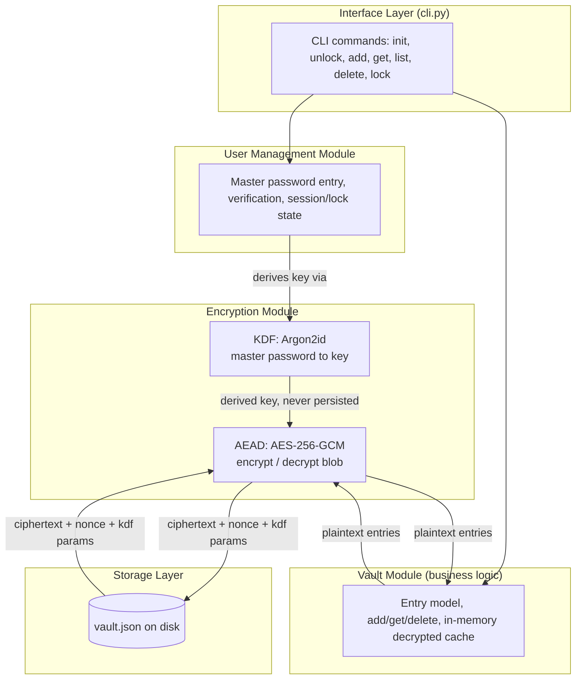

# Architecture — Checkpoint 1

## 1. Overview

The password manager is a local-first, offline CLI application. There is no
server component and no network calls: the entire attack surface is the
local machine. The system is split into three modules with a strict
one-directional dependency rule: **CLI → User Management → Vault →
Crypto/Storage**. Lower layers never import from higher layers, and the
Crypto module never touches the filesystem, and the Storage module never
sees plaintext.



## 2. Modules

### 2.1 Encryption module (`pwmanager/crypto/`)

Responsible for everything cryptographic and *only* that. It has no
knowledge of files, CLI, or the shape of a password entry.

- `kdf.py` — turns the master password + a stored salt into a 256-bit key
  using Argon2id. Never logs, prints, or returns the master password itself.
- `cipher.py` — thin wrapper around AES-256-GCM (`cryptography` library's
  `AESGCM`). Takes a key + plaintext bytes + associated data, returns
  nonce + ciphertext (tag included). Symmetric function decrypts and
  authenticates.

**Design rule:** the crypto module operates purely on `bytes` in and
`bytes` out. It is unit-testable without ever touching a vault file.

### 2.2 User management module (`pwmanager/vault/session.py`, planned)

Responsible for master-password handling and session state:

- Prompting for the master password (`getpass`, no echo).
- Verifying a supplied password against the vault (by attempting
  decryption / checking an authentication tag — there is no separate
  password hash stored, see design-decisions.md).
- Holding the *derived key* (not the password) in memory for the duration
  of an unlocked session.
- Enforcing lock/auto-lock and clearing the key from memory on lock/exit.

### 2.3 Vault module (`pwmanager/vault/vault.py`)

The domain layer: a `Vault` holds a list of `Entry` objects
(`title`, `username`, `password`, `url`, `notes`, timestamps). It exposes
`add_entry`, `get_entry`, `list_entries`, `delete_entry`, and
`to_bytes()` / `from_bytes()` for (de)serialising the entry list to/from
JSON *before* encryption. The vault module calls the crypto module to
seal/unseal itself; it never writes to disk directly.

### 2.4 Storage layer (`pwmanager/storage/file_storage.py`)

Responsible only for durable, safe persistence of the **opaque envelope**
produced by the crypto module:

```
{version, kdf params, nonce, ciphertext}
```

- Atomic writes (write to temp file, `fsync`, rename over the original) so
  a crash never leaves a half-written vault.
- Restrictive file permissions (`0600`) on creation.
- No knowledge of what the ciphertext contains.

## 3. Data flow

**Unlock / read:**
`disk file → Storage.load() → envelope (dict) → Crypto.decrypt(key, envelope) → plaintext JSON bytes → Vault.from_bytes() → in-memory Entry list`

**Save / write:**
`in-memory Entry list → Vault.to_bytes() → plaintext JSON bytes → Crypto.encrypt(key, plaintext) → envelope (dict) → Storage.save(envelope) → disk file`

The derived key is produced once per unlock (User Management module,
via the Encryption module's KDF) and passed by reference into the Vault
module for the session; it is discarded on lock.

## 4. Repository layout

```
password-manager/
├── README.md
├── requirements.txt
├── pyproject.toml
├── docs/
│   ├── architecture.md
│   ├── threat-model.md
│   └── design-decisions.md
├── src/pwmanager/
│   ├── __init__.py
│   ├── models.py            # Entry dataclass
│   ├── crypto/
│   │   ├── kdf.py           # Argon2id key derivation
│   │   └── cipher.py        # AES-256-GCM seal/unseal
│   ├── vault/
│   │   ├── vault.py         # Entry list <-> plaintext bytes, business logic
│   │   └── session.py       # master password verification, session/lock state
│   ├── storage/
│   │   └── file_storage.py  # atomic, permissioned file I/O
│   └── cli.py                # argparse entry point
└── tests/
    ├── test_kdf.py
    ├── test_cipher.py
    └── test_vault_roundtrip.py
```
